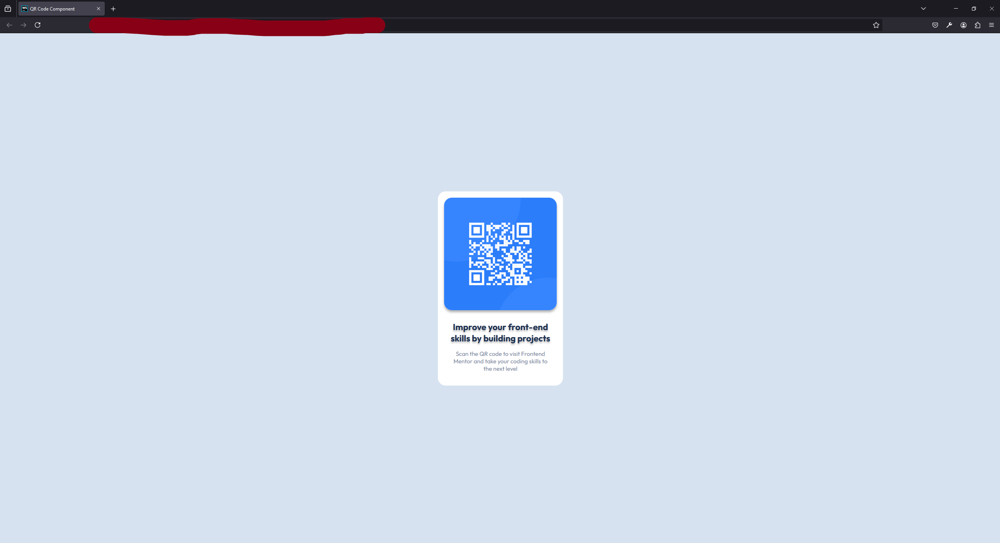
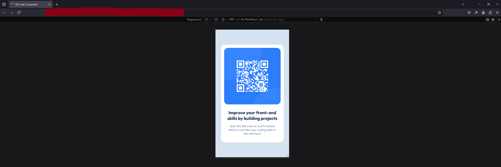

# Frontend Mentor - QR code component solution

This is a solution to the [QR code component challenge on Frontend Mentor](https://www.frontendmentor.io/challenges/qr-code-component-iux_sIO_H). Frontend Mentor challenges help you improve your coding skills by building realistic projects.

## Table of Contents

- [What I learned](#What-I-Learned)
- [Screenshot #1](#PC-version)
- [Screenshot #2](Mobile-version)
- [Project Link](#Project-Link)

### What-I-Learned

That's not a big project, but overall, it gives some basic practice and the most valuable thing I got here is some practice with colors and with both box and text shadows.

### PC-version

### Mobile-version

### Project-Link

Link: https://petyabiszeps.github.io/QR-Code-Challenge/